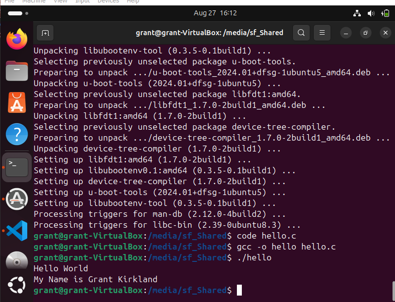

# Homework 2: GitHub Classrom and Markdownhttps://ecat.montana.edu/d2l/le/content/815050/viewContent/8480257/View

# Big Heading

A ~~d~~**i**_f_<sub>f</sub>***i***<sup>c</sup>u*l*t to read sentence

## Less-Big Heading


> The screenshot from lab 01

- item 3
- item C
- item III

2. item 4
3. item 5
4. item 1

>[!Caution]
> [This is a link to a website](https://de.wikipedia.org/wiki/Klugheit).

### Code
```c
#include <stdio.h>

int main() {
	printf("Hello World\n");
	return 0;
}
```

| Fruits | Vegetables |
| -------|---|
| Banana  | Carrot
