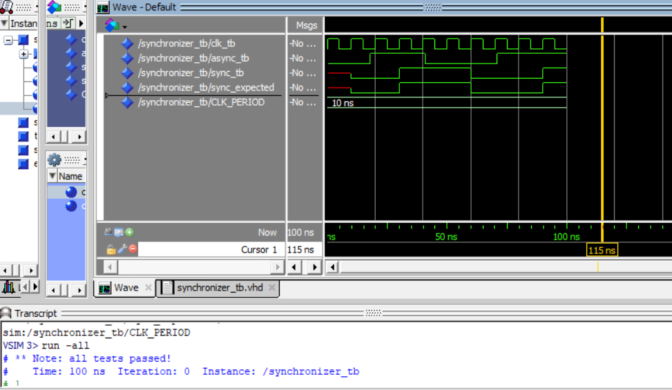

# Homework 3: Synchronizer VHDL

## Overview
Creation of a synchronizer component, functionally implemented as sequential flip-flops. This was then tested using a provided test bench to verify functionality.

## Deliverables

