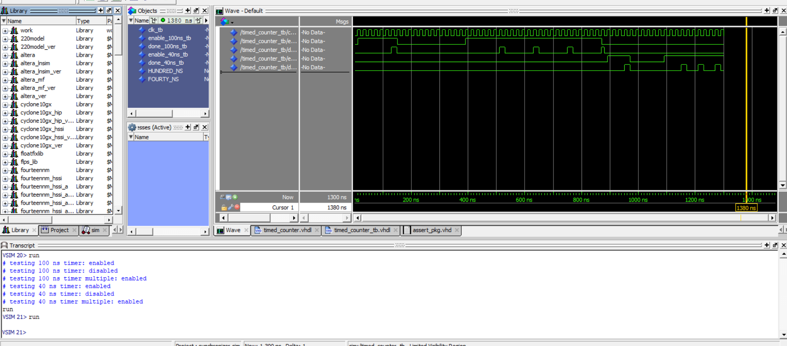

# Homework 4: Timed Counter VHDL

## Overview
Creation of a timed counter component, a counter that waits for a set amount of time before outputting high for one clock cycle. This also has an enable, only counting while the timer is enabled.
## Deliverables

