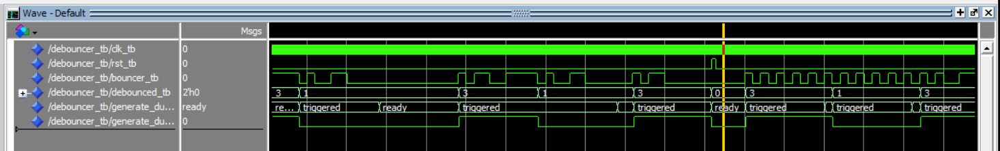
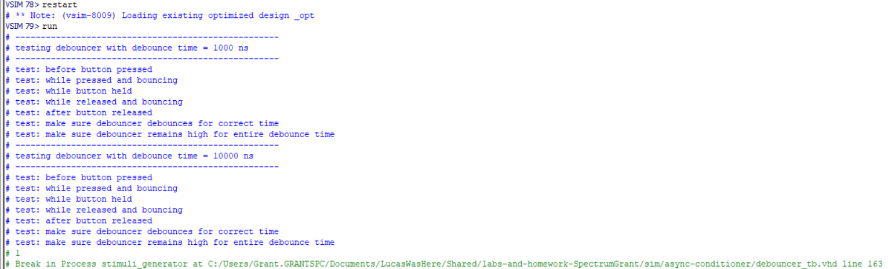
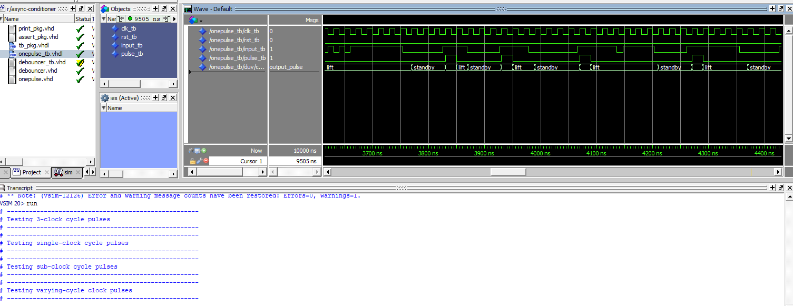
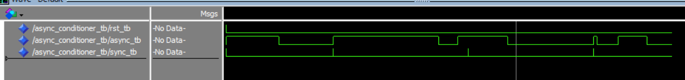

# Homework 5: Vending Machine VHDL

## Overview

This assignment had a state machine being made, with a clock and reset input, and two coin type inputs. Based on which coin was inserted the system tracked how much money was inserted until 15 or more cents were added at which point it would output a dispense signal.

## Deliverables

### Debouncer

### One Pulse

### Async Conditioner

