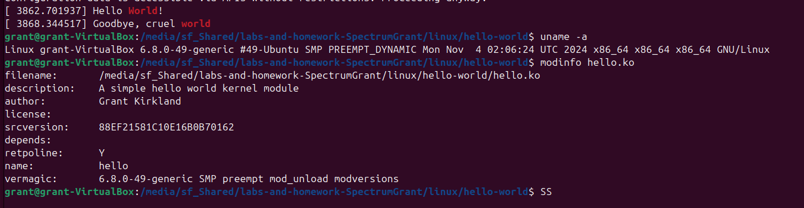

# Homework 8: "Hello World" Linux Kernel Module

## Overview

This assignment involved writing a basic kernel module that executed code on load and on exit. This was then built to be run on both the virtual machine as well as on the SoC.

## Deliverables

Hello on Linux VM

Hello on SoC

