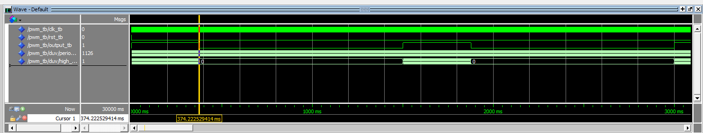
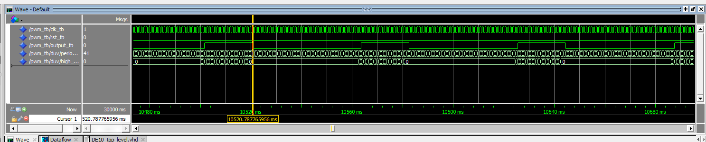
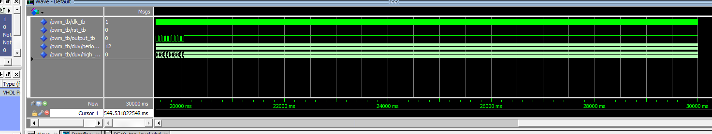
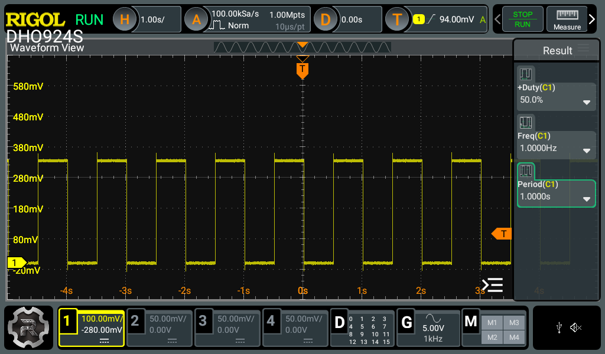

# Homework 10: RGB LED Controller VHDL

## Overview

This assignment involved creating a pulse width modulator with variable period and duty cycle, and then expands that to output three different signals which will drive 3 different LEDs. One red, one green, and one blue to allow a variety of different colors to be created.

## LED Resistor Calculations

Red

$$  R_1 > \frac{(3.3-2.1)}{0.02} = 60\ \Omega $$

$$ 252\frac{\text{lm}}{\text{W}} * 2.1 \text{ V} * \frac{(3.3 - 2.1)}{R_1} \frac{\text{V}}{\Omega} = \frac{635}{R_1} \text{lm}$$

$$ 252\frac{\text{lm}}{\text{W}} * 1.78 \text{ V} * \frac{(3.3 - 1.78)}{R_1} \frac{\text{V}}{\Omega} = \frac{681.8112}{R_1} \text{lm}$$

Green
$$  R_2 > \frac{(3.3-3.1)}{0.02} = 10\ \Omega $$

$$ 537\frac{\text{lm}}{\text{W}} * 3.1 \text{ V} * \frac{(3.3 - 3.1)}{R_2} \frac{\text{V}}{\Omega} = \frac{332.94}{R_2}\text{lm}$$
$$ 537\frac{\text{lm}}{\text{W}} * 2.23 \text{ V} * \frac{(3.3 - 2.23)}{R_2} \frac{\text{V}}{\Omega} = \frac{1281.3357}{R_2}\text{lm}$$

Blue
$$  R_3 > \frac{(3.3-3.1)}{0.02} = 10\ \Omega $$

$$ 79\frac{\text{lm}}{\text{W}} * 3.1 \text{ V} * \frac{(3.3 - 3.1)}{R_3} \frac{\text{V}}{\Omega} = \frac{48.98}{R_3}\text{lm}$$
$$ 79\frac{\text{lm}}{\text{W}} * 2.474 \text{ V} * \frac{(3.3 - 2.474)}{R_3} \frac{\text{V}}{\Omega} = \frac{161.44}{R_3}\text{lm}$$

## Deliverables

### Model Sim - Period 1.5s		Duty Cycle: 25%

### Model Sim - Period 62.5ms		Duty Cycle: 31.25%

### Model Sim - Period 250ms		Duty Cycle: 175%

### Oscilloscope Output - Period: 1s	Duty Cycle: 50%

