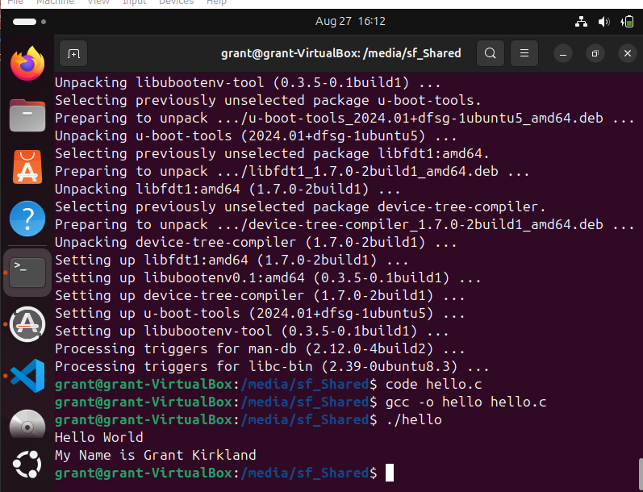

# Lab 1: Setting Up the Ubuntu Virtual Machine

## Overview
This lab had us setting up a virtual machine to run Ubuntu, installing necessary software, and then writing a simple c program and compiling it to verify things were working.

## Deliverables

