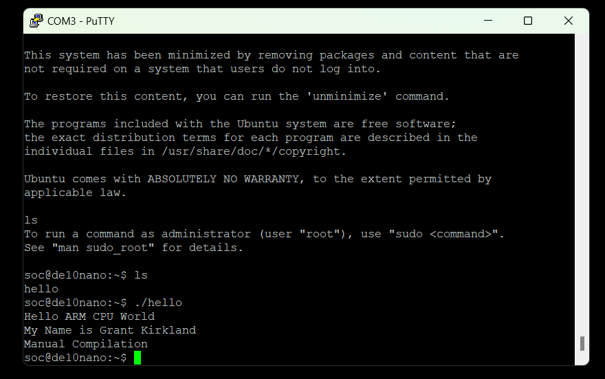

# Lab 3: Developer's Setup

## Overview

This lab involved setting up a local server to serve files to the dev board during its boot sequence, eliminating part of the lengthy programming setup.

## Deliverables

