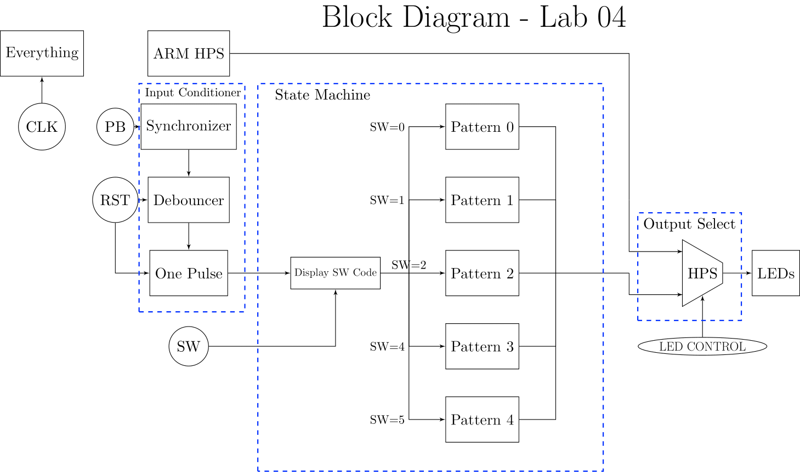

# Lab 4: LED Patterns

## Project Overview

The LED patterns project involved creating a vhdl program that was capable of switching between multiple output states. This involved implementing a number of different states that displayed differing LED patterns, as well as a state that displayed the current switch settings upon a button push, before the system would advance to the input LED state. Additionally, this system had the ability to set different base update multipliers, using a fixed point value, that would affect the update speed of the LED patterns. This system also had an override to allow for alternative input LED control.

### Functional Requirements

1. LED control can be overriden with HPS_LED_Control signal.

2. LED 7 acts as a heartbeat LED blinking at the base rate in seconds.

3. There are 5 LED states with differing update frequencies and patterns.

	1. This is a pattern involving a single lit LED shifting right at 1/2 * base rate seconds.
	2. This is a pattern involving two adjacent bits shifting left, at a rate of 1/4 * base rate seconds.
	3. This is a 7-bit up counter, updating every 2 * base rate seconds.
	4. This is a 7-bit down counter, updating every 1/8 * base rate seconds.
	5. This is a user defined pattern, updating every 1 * base rate seconds, outputting the last 7 bits in the Fibonacci sequence, starting from 1.

4. When the push button is pressed, the system displays switch code, and if it is valid switches to new state after 1 second. Otherwise stays in current state. The system only changes states on a push button input.

5. The external push-button signal is conditioned to produce a synchronous single pulse, with a period of 1 clock cycle.

## System Architecture

The system is largely composed of three blocks, the asynchronous control that conditions the pushbutton, the LED state machine, and the LED control, which outputs either the hardware state machine output or the software override to the LEDs.

The state machine consists of 6 states, one which displays the switch code, and 5 that display different LED patterns. When the push button is pressed, the system will switch from whichever display state that is currently active, to the switch display state. From here, after one second has passed, it will switch to the new state based on the switch inputs, or back to the previous state if the switch inputs are invalid.

## User Defined Pattern Implementation

The user defined pattern was implemented to update every 1 * base rate seconds, to fill in the pattern of each state being a multiple of two, raised to the powers -3, -2, -1, 0, and 1.

The pattern itself is the Fibbonaci sequence, displayed on 7 bits, starting with 1. This was implemented by keeping track of the previously displayed value and adding it to the current value each update. This was chosen to allow for values exceeding 7 bits to be displayed as the sequence quickly leaves the range allowable with just 7 bits of storage and is more visually interesting.
