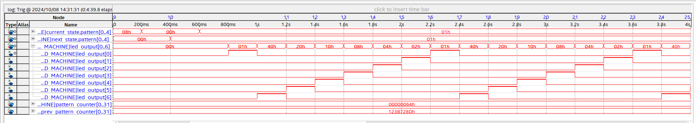
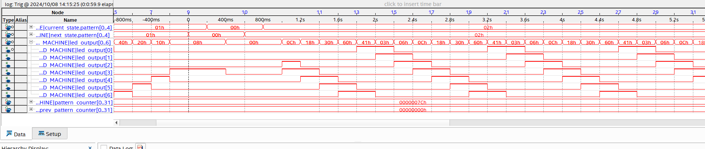
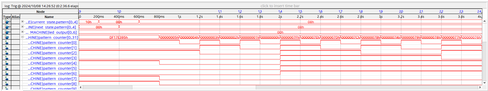

# Lab 5: Signal Tap

## Overview
This lab involved setting up an embedded logic analyzer to look at the program developed in lab 04 and verify the outputs are working. 

## Deliverables
Sample depth was set to 64, with transitional qualifiers for storage to minimize memory used, while keeping the acquisition time fast.

This setup had 5248 bits of memory used to record the two 32-bit counter integers, the current and next state values, and the pattern 00 and 01 output signal.

### Pattern 00

### Pattern 01

### Pattern 02

### Pattern 03

### Pattern 04

