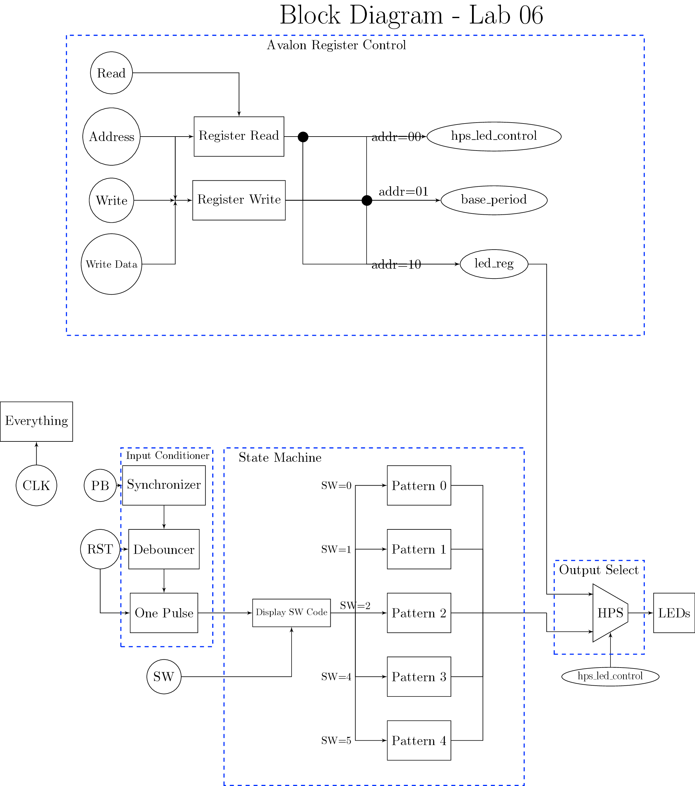
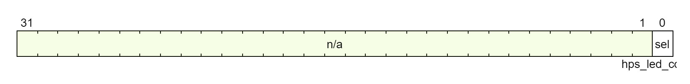
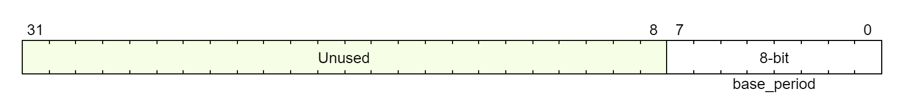
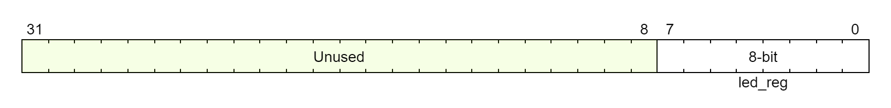

# Lab 6: Creating a Custom Hardware Component in Platform Designer

## Project Overview

The hardware component lab involved creating a custom hardware component linking communication channels to registers made in the FPGA.

## System Architecture

The system is built upon nested components, with an avalon wrapper having the previously built led_pattern component nested within, passing the buttons, switches, and leds to the component. The wrapper itself handles the read and write register signals.

## Register Map
The registers are read from by asserting the read signal while specifying an address. This moves the data from the register with the specified address to the read data output.

The registers are written to, by supplying an address and write data, then asserting the write bit, moving the specified data to the specified address.

| Name | Address |
| ---- | -------- |
|hps_led_control | 00 |
| base_period | 01 |
| led_reg | 10 |

### hps_led_control (address = 00): This selects which channel is being listened to, either the built in hardware led controls or the led patterns being given by the software.

### base_period (address = 01): This is the base period that the led patterns are referenced to. 8-bit fixed point number with 4 bits for the decimal.

### led_reg (address = 10): When displaying the software input LED pattern, this is the pattern that corresponds to the displayed LEDs.

## Platform Designer
The base address of the avalon component is 0x0000_0000. The registers were connected by using platform designer to generate vhdl code to connect the Hard processor system to the platform designer component that was made. This component in turn connects to the avalon bus wrapper that was created as part of this lab, supplying the signals to write and read from registers.
