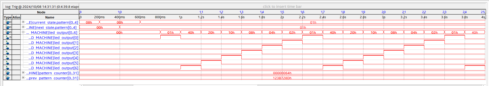
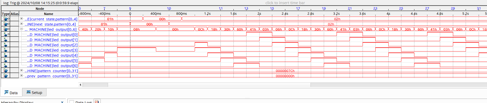
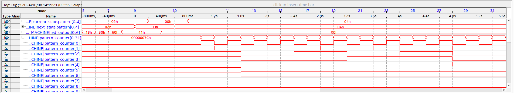
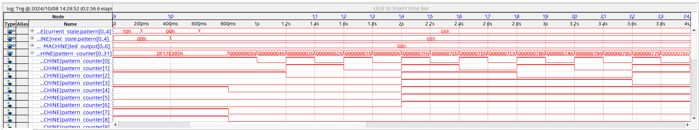
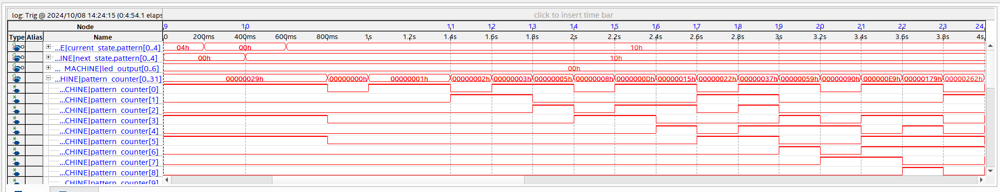

# Lab 7: Verifying Your Custom Component Using System Console and /dev/mem

## Overview
This lab involved setting up an embedded logic analyzer to look at the program developed in lab 04 and verify the outputs are working. 

Devmem command 
	./devmem 
		0xff200000	hps_led_control
			0x0000	
			0x0001	
		0xff200004	base_period
			
		0xff200008 	led_reg
			0x007F	7-bits corresponding to led states

## Demonstration
	

### Pattern 00

### Pattern 01

### Pattern 02

### Pattern 03

### Pattern 04

